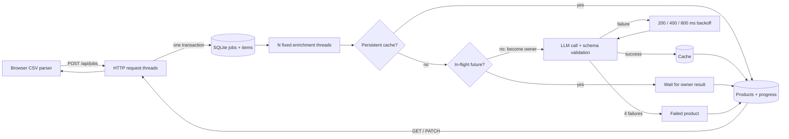

# CatalogIQ system design

## 1. Architecture and concurrency

The POST validates the whole batch, durably inserts the job and its immutable input snapshots, then returns 202. Exactly `LLM_CONCURRENCY` worker threads claim pending rows; requests use separate HTTP threads. Every worker makes at most one synchronous provider call at a time, so all jobs together have at most N calls. Retries stay within the same pool. Threads suit blocking HTTP I/O and need no third-party runtime; the GIL is released during I/O. Processes would add IPC overhead without useful CPU parallelism. Asyncio would scale to more waiting tasks but complicate the otherwise synchronous SQLite/HTTP code.

The cache key is exactly the lowercased, whitespace-collapsed title + space + description. A lock covers cache lookup and creation of one Future per in-flight key. The owner calls the provider without holding that lock; duplicates wait for its success or exception. Successful output is validated and durably cached before the Future is resolved. A short transaction then writes the product and advances job counters together. Per-SKU revision IDs prevent a slower older job overwriting newer input. An OS file lock allows only one server process per database. This implementation does **not** provide a distributed limit.

Tradeoff: waiting duplicates and retry backoff occupy workers. This sacrifices throughput for a small, explainable implementation. A future scheduler could coalesce items before dispatch and put retries on a timed queue. FIFO claiming also allows a large job to delay a small one; round-robin jobs would improve fairness.

## 2. Crash recovery

Jobs, item states, results, cache and cumulative metrics survive in SQLite WAL. On restart, `running` items become `pending`; `done` items stay done. In a 10,000-item job with 6,000 committed completions, only the remaining 4,000 are eligible to run. If a result was cached before the crash but completion was not committed, recovery completes from that cache. Product and progress changes share one transaction, preventing double-counting. Graceful shutdown finishes active calls or releases retrying work for restart.

There is an unavoidable gap after an external LLM response and before the cache commit: a crash there can repeat the external call. This is at-least-once external execution, not exactly once. Retry budgets for unfinished items restart after a crash; persist attempt records and provider idempotency keys to strengthen this. Multiple machines would require a durable shared queue, leases with expiry, heartbeats and fencing tokens; SQLite's local recovery reset would be unsafe there. Backups and schema migrations are also needed before production.

## 3. One million listings/day: capacity, limits and cost

One million/day averages 11.57 listings/second, before bursts. With cache hit fraction h and b products per prompt, baseline requests/minute are `1,000,000 × (1-h) / (1440 × b)`, plus retries. At h=0.5 and b=10 this is about 34.7 RPM. Batch only within token limits; map results back by stable item IDs, validate each item, and retry only failed members. Never assume a provider's per-minute limit is the same as a concurrency limit.

Use a distributed token bucket for requests AND tokens, shared by every worker/machine using the account. Respect Retry-After, add jitter and bounded retries, then queue overflow with observable queue age and backpressure. Scale consumers only within provider quotas. Cache normalized content centrally, coalesce in-flight requests, and version cache namespaces when changing prompts/models/taxonomy. Track cost per accepted product. A second provider can handle outages through a circuit breaker, with separate quota/cost budgets and the same validation. Avoid uncontrolled fallback on every transient failure. These production mechanisms are proposed, not implemented here.

## 4. API performance at five million products

Current SKU and `(category, sku)` indexes support lookups, filtering and ordering. However, `lower(title) LIKE '%q%'` scans candidate text; a normal B-tree cannot accelerate a leading wildcard. Deep OFFSET pages scan and discard rows, and exact COUNT can be expensive. Under the local database lock, long searches also delay writes. Keep transactions short, use separate read connections and move to PostgreSQL for concurrent scale. Use full-text indexes for token search, or trigram indexes to preserve substring semantics; FTS is not a drop-in replacement for substring matching. Use cursor pagination on a stable `(sku, id)` order, approximate/deferred counts, and short-lived query caches with invalidation on enrichment/approval. Measure query plans and p95 latency before tuning. The assignment retains its required page-based API.

## 5. Quality and human review

Schema validation catches invalid JSON, empty titles, unknown categories, bad brand types and malformed tags. It cannot prove that a plausible brand or category is correct. The prompt requires evidence for a brand and permits null/Other. Production checks should match brands against listing evidence and a verified alias dictionary, preserve quantities/units, and flag taxonomy-rule conflicts. Route unsupported brands, Other categories, quantity changes and model disagreement to review; sample apparently good results to detect silent errors. Calibrate confidence against a labeled evaluation set, never trust a model's self-reported confidence alone. Track category precision, brand hallucination rate and reviewer correction rate by model/prompt version. The UI supports raw/clean comparison and approval now; automated semantic quality scoring is future work. Human edits remain SKU-specific and do not mutate the shared enrichment cache.
